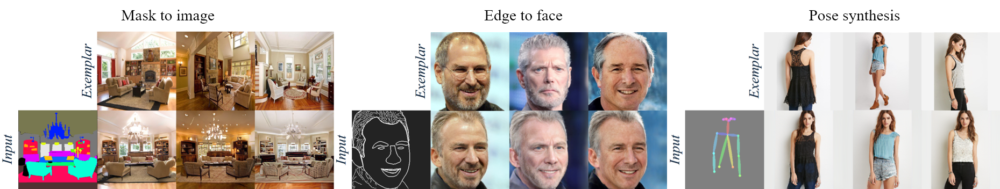

# Cross-domain Correspondence Learning for Exemplar-based Image Translation (CVPR 2020 oral, official Pytorch implementation)

### [Project page](https://panzhang0212.github.io/CoCosNet/) |   [Paper](https://arxiv.org/abs/2004.05571) | [Video](https://www.youtube.com/watch?v=BdopAApRSgo&feature=emb_logo)
<!-- Cross-domain Correspondence Learning for Exemplar-based Image Translation (CVPR 2020 Oral). -->
<!-- <br> -->
[Pan Zhang](https://panzhang0212.github.io/),  [Bo Zhang](https://www.microsoft.com/en-us/research/people/zhanbo/), [Dong Chen](https://www.microsoft.com/en-us/research/people/doch/),  [Lu Yuan](https://www.microsoft.com/en-us/research/people/luyuan/), and [Fang Wen](https://www.microsoft.com/en-us/research/people/fangwen/).
<!-- <br> -->


## Abstract
>We present a general framework for exemplar-based image translation, which synthesizes a photo-realistic image from the input in a distinct domain (e.g., semantic segmentation mask, or edge map, or pose keypoints), given an exemplar image. The output has the style (e.g., color, texture) in consistency with the semantically corresponding objects in the exemplar. We propose to jointly learn the cross domain correspondence and the image translation, where both tasks facilitate each other and thus can be learned with weak supervision. The images from distinct domains are first aligned to an intermediate domain where dense correspondence is established. Then, the network synthesizes images based on the appearance of semantically corresponding patches in the exemplar. We demonstrate the effectiveness of our approach in several image translation tasks. Our method is superior to state-of-the-art methods in terms of image quality significantly, with the image style faithful to the exemplar with semantic consistency. Moreover, we show the utility of our method for several applications.

## News
We recently propose [CoCosNet v2](https://github.com/microsoft/CoCosNet-v2), which brings more stunning results for high-resolution images. Welcome to have a try.

## Demo
<!--  -->
<p align="center">
  
</p>

## Installation
Clone the Synchronized-BatchNorm-PyTorch repository.
```
cd models/networks/
git clone https://github.com/vacancy/Synchronized-BatchNorm-PyTorch
cp -rf Synchronized-BatchNorm-PyTorch/sync_batchnorm .
cd ../../
````
Install dependencies:
```bash
pip install -r requirements.txt
````

## Inference Using Pretrained Model

#### 1) ADE20k (mask-to-image) 
Download the pretrained model from [here](https://drive.google.com/drive/folders/1BEBBENbEr9tutZsyGGc3REUuuOYqf6M3?usp=sharing) and save them in `checkpoints/ade20k`. Then run the command 
````bash
python test.py --name ade20k --dataset_mode ade20k --dataroot ./imgs/ade20k --gpu_ids 0 --nThreads 0 --batchSize 6 --use_attention --maskmix --warp_mask_losstype direct --PONO --PONO_C
````
The results are saved in [`output/test/ade20k`](https://github.com/panzhang0212/CoCosNet_Pytorch/blob/master/output/test/ade20k/0.png). If you don't want to use mask of exemplar image when testing, you can download model from [here](https://drive.google.com/drive/folders/1m4LXbOc00cu8hXCgf-_N55AIAE9R__m6?usp=sharing), save them in `checkpoints/ade20k`, and run
```` bash
python test.py --name ade20k --dataset_mode ade20k --dataroot ./imgs/ade20k --gpu_ids 0 --nThreads 0 --batchSize 6 --use_attention --maskmix --noise_for_mask --warp_mask_losstype direct --PONO --PONO_C --which_epoch 90
````

#### 2) Celebahq (mask-to-face)  
Download the pretrained model from [here](https://drive.google.com/drive/folders/16xgIrGzGBKJWbAUROM71wiA1cf7zrQk5?usp=sharing), save them in `checkpoints/celebahq`, then run the command:
````bash
python test.py --name celebahq --dataset_mode celebahq --dataroot ./imgs/celebahq --gpu_ids 0 --nThreads 0 --batchSize 4 --use_attention --maskmix --warp_mask_losstype direct --PONO --PONO_C --warp_bilinear --adaptor_kernel 4
````
, then the results will be saved in [`output/test/celebahq`](https://github.com/panzhang0212/CoCosNet_Pytorch/blob/master/output/test/celebahq/0.png).

#### 3) Celebahq (edge-to-face) 
Download the pretrained model from [here](https://drive.google.com/drive/folders/1SCUrAPsEb6HOx8EtI89ED4wsOR8mrPDF?usp=sharing), save them in `checkpoints/celebahqedge`, then run  
````bash
python test.py --name celebahqedge --dataset_mode celebahqedge --dataroot ./imgs/celebahqedge --gpu_ids 0 --nThreads 0 --batchSize 4 --use_attention --maskmix --PONO --PONO_C --warp_bilinear --adaptor_kernel 4
````
the results will be stored in [`output/test/celebahqedge`](https://github.com/panzhang0212/CoCosNet_Pytorch/blob/master/output/test/celebahqedge/0.png).

#### 4) DeepFashion (pose-to-image)
Download the pretrained model from [here](https://drive.google.com/drive/folders/1vyzTdhQqY9ljsAx4u4xPvytX3wR75GYB?usp=sharing), save them in `checkpoints/deepfashion`, then run the following command:
````bash
python test.py --name deepfashion --dataset_mode deepfashion --dataroot ./imgs/DeepFashion --gpu_ids 0 --nThreads 0 --batchSize 4 --use_attention --PONO --PONO_C --warp_bilinear --no_flip --warp_patch --video_like --adaptor_kernel 4
````
and the results are saved in [`output/test/deepfashion`](https://github.com/panzhang0212/CoCosNet_Pytorch/blob/master/output/test/deepfashion/0.png).

## Training

**Pretrained VGG model** Download from [here](https://drive.google.com/file/d/1fp7DAiXdf0Ay-jANb8f0RHYLTRyjNv4m/view?usp=sharing), move it to `models/`. This model is used to calculate training loss.
#### 1) ADE20k (mask-to-image)  
- **Dataset** Download [ADE20k](https://groups.csail.mit.edu/vision/datasets/ADE20K/), move `ADEChallengeData2016/annotations/ADE_train_*.png` to `ADEChallengeData2016/images/training/`, `ADEChallengeData2016/annotations/ADE_val_*.png` to `ADEChallengeData2016/images/validation/

- **Retrieval_pairs** We use image retrieval to find exemplars for exemplar-based training. Download `ade20k_ref.txt` and `ade20k_ref_test.txt` from [here](https://drive.google.com/drive/folders/1BKrEtEE2u5eZgAkviBo0TJJNDM4F4wga?usp=sharing), save or replace them in `data/`

- Run the command, note `dataset_path` is your ade20k root, e.g., `/data/Dataset/ADEChallengeData2016/images`. We use 8 32GB Tesla V100 GPUs for training. You can set `batchSize` to 16, 8 or 4 with fewer GPUs and change `gpu_ids`.
    ````bash
    python train.py --name ade20k --dataset_mode ade20k --dataroot dataset_path --niter 100 --niter_decay 100 --use_attention --maskmix --warp_mask_losstype direct --weight_mask 100.0 --PONO --PONO_C --batchSize 32 --vgg_normal_correct --gpu_ids 0,1,2,3,4,5,6,7
    ````
    
- If you don't want to use mask of the exemplar image when testing, you can run 
    ````bash
    python train.py --name ade20k --dataset_mode ade20k --dataroot dataset_path --niter 100 --niter_decay 100 --use_attention --maskmix --noise_for_mask --mask_epoch 150 --warp_mask_losstype direct --weight_mask 100.0 --PONO --PONO_C --vgg_normal_correct --batchSize 32 --gpu_ids 0,1,2,3,4,5,6,7
    ````

#### 2) Celebahq (mask-to-face) 
- **Dataset** Download [Celebahq](https://drive.google.com/file/d/1badu11NqxGf6qM3PTTooQDJvQbejgbTv/view), we combine the parsing mask except glasses. You can download and unzip [annotations](https://drive.google.com/file/d/125MBR5dZcqaCVXnXu-6aJw4nXxFrLvxJ/view?usp=sharing), then move folder `all_parts_except_glasses/` to `CelebAMask-HQ/CelebAMask-HQ-mask-anno/`
- **Retrieval_pairs** We use image retrieval to find exemplars for examplar-based training. Download `celebahq_ref.txt` and `celebahq_ref_test.txt` from [here](https://drive.google.com/drive/folders/1WQmRKRdRb_E-AMh_K-iGcoEYEqll4pWz?usp=sharing), save or replace them in `data/`
- **Train_Val split** We randomly split images to train set and validation set. Download `train.txt` and `val.txt` from [here](https://drive.google.com/drive/folders/1y2vvt3Cy_rh3UdYOY27g1Gxnp9Q_Kgv4?usp=sharing), save them in `CelebAMask-HQ/`
- Run the command, note `dataset_path` is your celebahq root, e.g. `/data/Dataset/CelebAMask-HQ`. In our experiment we use 8 32GB Tesla V100 GPUs for training. You can set `batchSize` to 16, 8 or 4 with fewer GPUs and change `gpu_ids`.
    ````bash
    python train.py --name celebahq --dataset_mode celebahq --dataroot dataset_path --niter 30 --niter_decay 30 --which_perceptual 4_2 --weight_perceptual 0.001 --use_attention --maskmix --warp_mask_losstype direct --weight_mask 100.0 --PONO --PONO_C --vgg_normal_correct --fm_ratio 1.0 --warp_bilinear --warp_cycle_w 0.1 --batchSize 32 --gpu_ids 0,1,2,3,4,5,6,7
    ````

#### 3) Celebahq (edge-to-face)  
- **Dataset** Download the [dataset](https://drive.google.com/file/d/1badu11NqxGf6qM3PTTooQDJvQbejgbTv/view)
- **Retrieval_pairs** same as **Celebahq (Mask-to-face)** 
- **Train_Val split** same as **Celebahq (Mask-to-face)** 
- Run the following command. Note that `dataset_path` is your celebahq root, e.g. `/data/Dataset/CelebAMask-HQ`. We use 8 32GB Tesla V100 GPUs to train the network. You can set `batchSize` to 16, 8 or 4 with fewer GPUs and change `gpu_ids`.
    ````bash
    python train.py --name celebahqedge --dataset_mode celebahqedge --dataroot dataset_path --niter 30 --niter_decay 30 --which_perceptual 4_2 --weight_perceptual 0.001 --use_attention --maskmix --PONO --PONO_C --vgg_normal_correct --fm_ratio 1.0 --warp_bilinear --warp_cycle_w 1 --batchSize 32 --gpu_ids 0,1,2,3,4,5,6,7
    ````

#### 4) DeepFashion (pose-to-image)
- **Dataset** Download [DeepFashion](https://drive.google.com/drive/folders/0B7EVK8r0v71pVDZFQXRsMDZCX1E), we use [OpenPose](https://github.com/Hzzone/pytorch-openpose) to estimate pose of DeepFashion. Download and unzip [openpose results](https://drive.google.com/file/d/1Vzpl3DpHZistiEjXXb0Blk4L12LsDluU/view?usp=sharing), then move folder `pose/` to `DeepFashion/`
- **Retrieval_pairs** Download `deepfashion_ref.txt`, `deepfashion_ref_test.txt` and `deepfashion_self_pair.txt` from [here](https://drive.google.com/drive/folders/1FEMuwWZqk_cuzl7HSSbCrtl1ynIE0zIE?usp=sharing), save or replace them in `data/`
- **Train_Val split** Download `train.txt` and `val.txt` from [here](https://drive.google.com/drive/folders/1kLOeRYZ1wUDzo3eg9ZihJj-yuyDQhp_T?usp=sharing), save them in `DeepFashion/`
- Run the following command. Note that `dataset_path` is your DeepFashion dataset root, e.g. `/data/Dataset/DeepFashion`. We use 8 32GB Tesla V100 GPUs to train the network. You can set `batchSize` to 16, 8 or 4 with fewer GPUs and change `gpu_ids`.
    ````bash
    python train.py --name deepfashion --dataset_mode deepfashion --dataroot dataset_path --niter 50 --niter_decay 50 --which_perceptual 4_2 --weight_perceptual 0.001 --use_attention --real_reference_probability 0.0 --PONO --PONO_C --vgg_normal_correct --fm_ratio 1.0 --warp_bilinear --warp_self_w 100 --no_flip --warp_patch --video_like --batchSize 32 --gpu_ids 0,1,2,3,4,5,6,7
    ````

## Citation
If you use this code for your research, please cite our papers.
```
@inproceedings{zhang2020cross,
  title={Cross-domain Correspondence Learning for Exemplar-based Image Translation},
  author={Zhang, Pan and Zhang, Bo and Chen, Dong and Yuan, Lu and Wen, Fang},
  booktitle={Proceedings of the IEEE/CVF Conference on Computer Vision and Pattern Recognition},
  pages={5143--5153},
  year={2020}
}
```
Also, welcome to refer to our [CoCosNet v2](https://github.com/microsoft/CoCosNet-v2):
```
@InProceedings{Zhou_2021_CVPR,
author={Zhou, Xingran and Zhang, Bo and Zhang, Ting and Zhang, Pan and Bao, Jianmin and Chen, Dong and Zhang, Zhongfei and Wen, Fang},
title={CoCosNet v2: Full-Resolution Correspondence Learning for Image Translation},
booktitle={Proceedings of the IEEE/CVF Conference on Computer Vision and Pattern Recognition (CVPR)},
year={2021},
pages={11465-11475}
}
```

## Acknowledgments
This code borrows heavily from [SPADE](https://github.com/NVlabs/SPADE). We also thank Jiayuan Mao for his [Synchronized Batch Normalization code](https://github.com/vacancy/Synchronized-BatchNorm-PyTorch).
